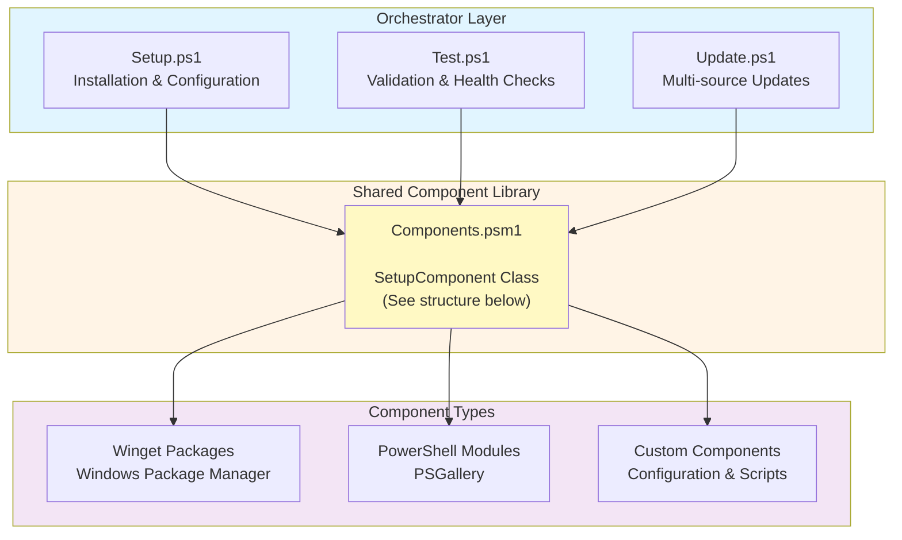

# Architecture Overview

PowerShell DevKit is built on an enterprise-grade, component-based architecture designed for maintainability, extensibility, and reliability.

## Design Principles

### 1. Component-Based Design

The system uses a **shared component library** (`Components.psm1`) that provides a single source of truth for all component definitions. This ensures consistency across all orchestrator scripts.

**Key Benefits:**

- **DRY Principle** - No duplication between Setup.ps1, Test.ps1, and Update.ps1
- **Maintainability** - Single place to modify component definitions
- **Consistency** - Same component logic across all scripts
- **Extensibility** - Easy to add new components

### 2. Intelligent Failure Recovery

Advanced logging system with actionable suggestions that helps users diagnose and resolve issues quickly.

**Features:**

- JSON-based diagnostics with full context
- Smart suggestion engine based on error patterns
- Failure frequency tracking
- Component-specific troubleshooting

### 3. Modular Orchestration

Three main orchestrator scripts handle different lifecycle phases:

- **Setup.ps1** - Initial installation and configuration
- **Test.ps1** - Validation and health checking
- **Update.ps1** - Multi-source package updates

## System Architecture



### SetupComponent Class Structure

```powershell
class SetupComponent {
    [string]$Name
    [string]$Type                      # winget | module | custom
    [hashtable]$Properties
    [bool]$IsOptional
    [scriptblock]$CustomInstaller
    [scriptblock]$CustomValidator
}
```## Component Definition Structure

Each component in the system follows a standardized definition:

```powershell
@{
    Name = "ComponentName"
    Type = "winget" | "module" | "custom"
    IsOptional = $false
    Properties = @{
        # Type-specific properties
        PackageId = "..."      # For winget
        ModuleName = "..."     # For module
        # etc.
    }
    CustomInstaller = { }      # Optional custom logic
    CustomValidator = { }      # Optional custom validation
}
```

### Type: winget

For Windows Package Manager packages:

```powershell
@{
    Name = "oh-my-posh"
    Type = "winget"
    IsOptional = $false
    Properties = @{
        PackageId = "JanDeDobbeleer.OhMyPosh"
    }
}
```

### Type: module

For PowerShell Gallery modules:

```powershell
@{
    Name = "PSFzf"
    Type = "module"
    IsOptional = $false
    Properties = @{
        ModuleName = "PSFzf"
        MinimumVersion = "2.5.0"
    }
}
```

### Type: custom

For custom installation/validation logic:

```powershell
@{
    Name = "Yazi Configuration"
    Type = "custom"
    IsOptional = $false
    Properties = @{
        ConfigRepo = "https://github.com/Tsabo/yazi_config.git"
        ConfigPath = "$env:APPDATA\yazi"
    }
    CustomInstaller = {
        # Custom installation logic
    }
    CustomValidator = {
        # Custom validation logic
    }
}
```

## Data Flow

### Setup Process

1. **Load Components** - Import component definitions from `Components.psm1`
2. **Filter Components** - Apply `-SkipOptional` if specified
3. **Install Components** - Iterate through components and install based on type
4. **Deploy Configuration** - Copy configuration files to appropriate locations
5. **Validate Installation** - Run validation checks
6. **Log Failures** - Record any failures with detailed context

### Test Process

1. **Load Components** - Import component definitions
2. **Validate Each** - Test installation and configuration
3. **Collect Results** - Gather version information and status
4. **Display Report** - Show categorized results with summary

### Update Process

1. **Load Components** - Import component definitions
2. **Update by Type** - Group by package manager
3. **Parallel Updates** - Update multiple sources concurrently
4. **Validate Updates** - Verify updates completed successfully
5. **Log Failures** - Record any failures

## Logging and Diagnostics

### Log Structure

Logs are stored in `Scripts/Logs/` as JSON files:

```json
{
  "Timestamp": "2025-11-02 10:30:15",
  "Component": "Yazi",
  "Type": "winget",
  "Operation": "winget install sxyazi.yazi",
  "ErrorMessage": "Network timeout",
  "FullOutput": "...",
  "ExitCode": 1,
  "IsAdmin": false
}
```

### Log Files

- `setup-details.json` - Setup operation failures
- `update-details.json` - Update operation failures

Logs automatically rotate, keeping only the last 50 entries.

## Configuration Management

### Configuration Locations

| Component | Source | Destination |
|-----------|--------|-------------|
| PowerShell Profile | `PowerShell/Microsoft.PowerShell_profile.ps1` | `$PROFILE` |
| Windows Terminal | `Config/WindowsTerminal/settings.json` | `%LOCALAPPDATA%\Packages\Microsoft.WindowsTerminal_...\LocalState\settings.json` |
| oh-my-posh Themes | `Config/oh-my-posh/*.omp.json` | Referenced by profile |
| Yazi Config | Git repository | `%APPDATA%\yazi\` |

### Git-Based Configuration

Yazi configuration uses a separate git repository for better management:

- **Repository**: https://github.com/Tsabo/yazi_config
- **Location**: `%APPDATA%\yazi\`
- **Benefits**: Easy sharing, version control, separate updates

## Extension Points

### Adding New Components

To add a new component to the system:

1. **Define Component** in `Components.psm1`:
```powershell
@{
    Name = "NewTool"
    Type = "winget"
    IsOptional = $false
    Properties = @{
        PackageId = "Publisher.NewTool"
    }
}
```

2. **Test** - Component automatically available in all scripts
3. **Validate** - Run `Test.ps1` to verify

### Custom Installation Logic

For components requiring custom installation:

```powershell
@{
    Name = "CustomComponent"
    Type = "custom"
    IsOptional = $false
    CustomInstaller = {
        param($Component)
        # Your custom installation logic here
        # Return $true on success, $false on failure
    }
    CustomValidator = {
        param($Component)
        # Your custom validation logic here
        # Return hashtable with IsInstalled, Version, etc.
    }
}
```

## Performance Considerations

### Timeout Protection

All operations have built-in timeouts to prevent hangs:

- **Package checks**: 15 seconds
- **Package installation**: 60 seconds
- **Git operations**: 30 seconds

### Parallel Processing

Where possible, operations run in parallel:

- Winget package installations
- PowerShell module installations
- Git repository updates

### Deferred Loading

PowerShell profile uses deferred module loading for fast startup:

- Modules load on PowerShell idle event
- Custom modules auto-discovered at runtime
- Minimal profile execution time

## Security Considerations

### Execution Policy

Scripts require `RemoteSigned` execution policy:

```powershell
Set-ExecutionPolicy -ExecutionPolicy RemoteSigned -Scope CurrentUser
```

### Administrator Rights

- **Not required** for most operations
- **Recommended** for font installation
- **Required** for some optional components (gsudo)

### Network Security

All downloads from trusted sources:

- **winget**: Microsoft-verified packages
- **PSGallery**: PowerShell Gallery
- **GitHub**: Official repositories

## See Also

- [Component System Details](components.md)
- [Failure Recovery System](failure-recovery.md)
- [Contributing Guide](../development/contributing.md)
