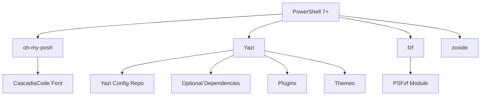

# Component Overview

PowerShell DevKit includes a carefully curated set of tools and components to create a powerful development environment.

## Component Categories

### 🎯 Core Tools
Essential command-line tools that form the foundation of your environment.

[Learn more about core tools →](#core-tools)

### 📚 PowerShell Modules
PowerShell Gallery modules that enhance your shell experience.

[Learn more about modules →](#powershell-modules)

### 🎨 Yazi Ecosystem
Complete file manager with plugins, themes, and optional dependencies.

<!-- [Learn more about Yazi →](yazi.md) -->
[Learn more about Yazi →](#yazi)

### 🔧 Configuration
Profile, terminal settings, and theme configurations.

[Learn more about configuration →](#configuration-files)

---

## Core Tools

### oh-my-posh
**Purpose:** Prompt theme engine
**Source:** winget
**Status:** Required

A prompt theme engine that makes your terminal beautiful and informative.

<!-- [Detailed oh-my-posh guide →](oh-my-posh.md) -->
*(Detailed guide coming soon)*

### Yazi
**Purpose:** Terminal file manager
**Source:** winget
**Status:** Required

Modern, blazing-fast terminal file manager with previews and plugins.

<!-- [Detailed Yazi guide →](yazi.md) -->
*(Detailed guide coming soon)*

### fzf
**Purpose:** Fuzzy finder
**Source:** winget
**Status:** Required

Command-line fuzzy finder for files, history, and more.

**Common uses:**
- `Ctrl+T` - Fuzzy find files
- `Ctrl+R` - Fuzzy find history
- `Alt+C` - Fuzzy find directories

### zoxide
**Purpose:** Smart directory navigation
**Source:** winget
**Status:** Required

A smarter `cd` command that remembers your most-used directories.

**Example:**
```powershell
# Add bookmark (automatic)
cd C:\Projects\MyApp

# Jump from anywhere
z MyApp
```

### Microsoft Edit
**Purpose:** Modern text editor
**Source:** winget
**Status:** Required

Modern alternative to notepad.exe.

---

## PowerShell Modules

### PSFzf
**Repository:** PSGallery
**Status:** Required

Integrates fzf into PowerShell with keyboard shortcuts.

### Terminal-Icons
**Repository:** PSGallery
**Status:** Required

Adds file and folder icons to directory listings.

### F7History
**Repository:** PSGallery
**Status:** Required

Enhanced history search with F7 key.

### posh-git
**Repository:** PSGallery
**Status:** Required

Git status information in your prompt.

### PowerColorLS
**Repository:** PSGallery
**Status:** Optional

Colorized directory listings.

---

## Configuration Files

### Windows Terminal Settings
- **Location:** `Config/WindowsTerminal/settings.json`
- **Deployed to:** Windows Terminal config directory
- **Features:** Font settings, color schemes, window configuration

<!-- [Learn more →](terminal.md) -->
*(Detailed guide coming soon)*

### PowerShell Profile
- **Location:** `PowerShell/Microsoft.PowerShell_profile.ps1`
- **Deployed to:** `$PROFILE`
- **Features:** Module imports, custom functions, aliases

<!-- [Learn more →](powershell.md) -->
*(Detailed guide coming soon)*

### oh-my-posh Themes
- **Location:** `Config/oh-my-posh/`
- **Themes:** `paradox.omp.json`, `iterm2.omp.json`
- **Features:** Custom prompt layouts, git integration

<!-- [Learn more →](oh-my-posh.md) -->
*(Detailed guide coming soon)*

### Yazi Configuration
- **Source:** [yazi_config repository](https://github.com/Tsabo/yazi_config)
- **Location:** `%APPDATA%\yazi`
- **Features:** Key bindings, theme, plugins

<!-- [Learn more →](yazi.md) -->
*(Detailed guide coming soon)*

---

## Optional Components

### gsudo
**Purpose:** Elevated permissions helper
**Status:** Optional

Run commands with elevated permissions without opening a new window.

### Scoop + resvg
**Purpose:** SVG thumbnail support for Yazi
**Status:** Optional

Enables SVG file previews in Yazi.

**Installation:**
```powershell
# Install Scoop
iwr -useb get.scoop.sh | iex

# Install resvg
scoop bucket add extras
scoop install resvg
```

---

## Component Dependencies



---

## Next Steps

<!-- More detailed guides coming soon:
- [oh-my-posh Configuration →](oh-my-posh.md)
- [Yazi Setup →](yazi.md)
- [Windows Terminal →](terminal.md)
- [PowerShell Profile →](powershell.md)
- [Optional Tools →](optional.md)
-->

For now, see:
- [Quick Start Guide →](../getting-started/quick-start.md)
- [Installation Guide →](../getting-started/installation.md)
- [Troubleshooting →](../troubleshooting.md)
